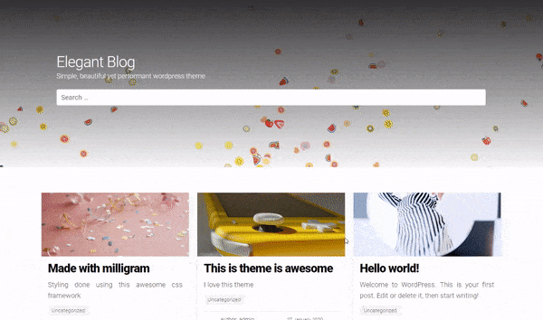
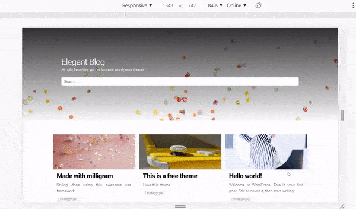

> ​	Beautiful, elegant, responsive and performant wordpress theme bases on millgram.css

## Why choose this ?
---

milligram_wordpress is based on milligram css, hence it has a storng foundational design language. Being minimal it is performant as well and shipping with minified static files lowers the load time. Theme is designed keeping in mind the mobile first approach. So, it will be performant on all kind of devices. 

---

## Fully Responsive



> Designed to capture 4 standard breakpoints. Therefore covering most of the devices

---

## Installing this theme

- In your `wordpress` directory, on your server or local machine, run

  ```bash
  cd wp-content/themes/
  ```

- Then clone the repository

  ```
  sudo git clone https://github.com/Reepulse/milligram_wordpress.git
  ```

- Login to your admin dashboard by visiting `https://your_site_url/wp-admin/`

- Then click on installed themes

- Then select the milligram_wordpress theme

- Activate theme and customize accordingly

---


